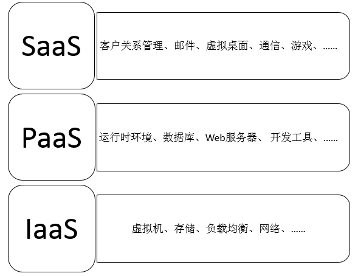
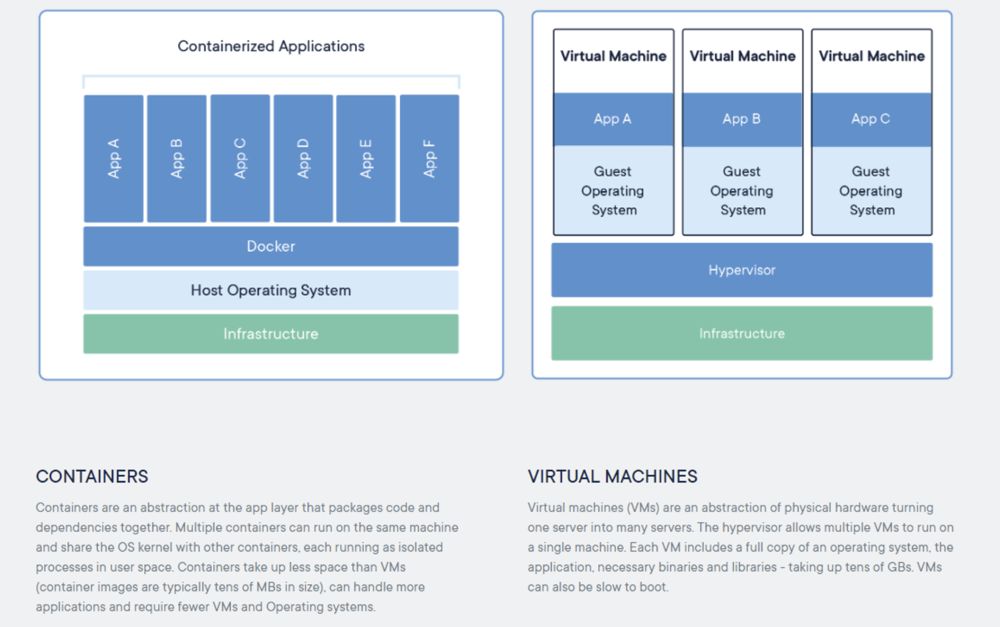
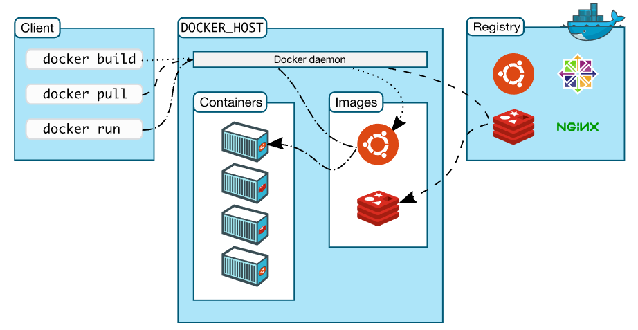
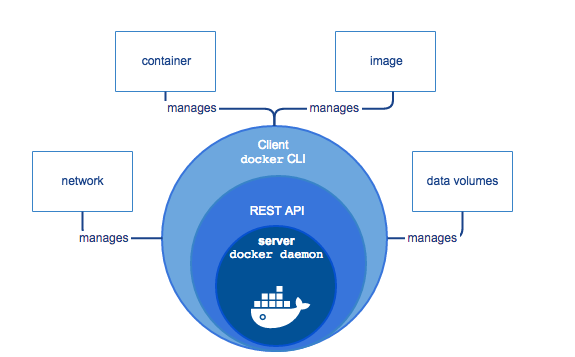
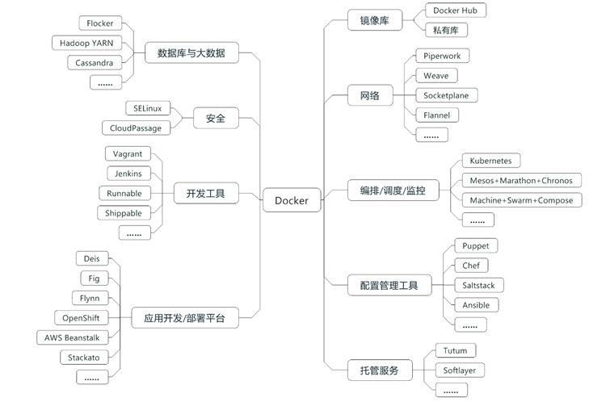
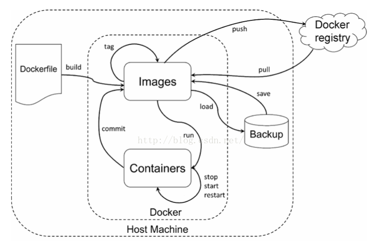

# Docker 与 K8s

---

## Why Container? (从云计算到容器云)

以前几乎所有的应用都采用三层架构(Presentation/Application/Data)，系统部署到有限几台服务器上。

而今天，开发人员通常使用多种服务（比如MQ,Cache,DB）构建和组装应用，而且应用可能会部署到不同环境，比如虚拟服务器，私有云和公有云。

一方面应用包含多种服务，这些服务有自己所以来的库和软件包；另一方面存在多种部署环境，服务在运行时可能需要动态迁移到不同环境中。这就产生了一个问题：

*如何让每种服务能够在所有的部署环境中顺利进行？*

各种服务与环境排列组合产生了一个大矩阵，开发人员需要考虑不同的运行环境，运维人员需要为不同的服务和平台配置环境。这对双方而言，都是一项艰难的任务。

如何解决这个问题呢？

---

最终程序员们从传统运输业找到了答案。

几十年前，运输业面临着类似的问题。

每一次运输，货主与承运方都会担心因货物类型的不同而导致损失，比如几个铁桶错误地压在了一堆香蕉上。另一方面，运输过程中需要使用不同的交通工具也让整个过程痛苦不堪：货物先装上车运到码头，卸货，然后装上船，到岸后又卸下船，再装上火车，到达目的地，最后卸货。一半以上的时间花费在装、卸货上，而且搬上搬下还容易损坏货物。
这也是一个N x M 的矩阵。

集装箱的发明解决这个难题。

任何货物，无论钢琴还是保时捷，都被放到各自的集装箱中。集装箱在整个运输过程中都是密封的，只有到达最终目的地才被打开。标准集装箱可以被高效地装卸、重叠和长途运输。现代化的起重机可以自动在卡车、轮船和火车之间移动集装箱。集装箱被誉为运输业与世界贸易最重要的发明。

Docker 将集装箱思想运用到软件打包上，为代码提供了一个基于容器的标准化运输系统。Docker 可以将任何应用及其依赖打包成一个轻量级、可移植、自包含的容器。容器可以运行在几乎所有的操作系统上。

---

|特性 | 	集装箱	|Docker|
| --- | --- | --- |
| 打包对象 |	几乎任何货物	| 任何软件及其依赖 |
| 硬件依赖 | 	标准形状和接口允许集装箱被装卸到各种交通工具，整个运输过程无需打开 | 容器无需修改便可运行在几乎所有的平台上 -- 虚拟机、物理机、公有云、私有云 |
| 隔离性 | 	集装箱可以重叠起来一起运输，香蕉再也不会被铁桶压烂了 | 资源、网络、库都是隔离的，不会出现依赖问题 |
| 自动化	| 标准接口使集装箱很容易自动装卸和移动 | 提供 run, start, stop 等标准化操作，非常适合自动化 |
| 高效性	| 无需开箱，可在各种交通工具间快速搬运 | 轻量级，能够快速启动和迁移 |
| 职责分工 | 货主只需考虑把什么放到集装箱里；承运方只需关心怎样运输集装箱	| 开发人员只需考虑怎么写代码；运维人员只需关心如何配置基础环境 |

---

容器的思想，正好与云计算的需求不谋而合。

云计算的定义：

*云计算是一个种资源的服务模式。可随时随地、按需获取资源(网络、服务器，存储，应用)，能实现快速供应并释放，大大减少资源管理工作的成本。*

经典容器云三层结构：

+ IaaS(Infrastructure as a Service、基础设施即服务)，提供计算、存储、网络等其它基础资源。
+ PaaS(Platform as a Service、平台即服务)，提供支撑应用运行所需的软件运行时环境。如：数据库、日志、监控等服务，让应用开发者可以专注于核心业务的开发。
+ SaaS(Software as a Service、软件即服务) 提供了一套完整可用的软件系统，让一般用户无需关注技术细节，只需通过浏览器、客户端等方式就能使用部署在云上的应用服务。

---

---

云计算面临着以下问题：

1. IaaS 主要以虚拟机为最小粒度的资源调度单位，导致了资源利用率低、调度分发缓慢、软件栈环境不统一等一系列问题。
2. PaaS 在IaaS 的基础上发展而来，尽管容器技术可以解决资源利用率的问题，但是PaaS 通常在应用架构选择，支持的软件环境服务方面有较大的限制，造成了应用与平台无法解耦、应用运行时依赖强，运维人员控制力下降的问题。

---
基于虚拟机的云计算 vs 容器云

[what-container](https://www.docker.com/resources/what-container)

---

所有的容器共享同一个 Host OS，这使得容器在体积上要比虚拟机小很多。另外，启动容器不需要启动整个操作系统，所以容器部署和启动速度更快，开销更小，也更容易迁移。

*容器云：* 容器云以容器为资源分割和调度的基本单位，封装整个软件运行时环境，为开发者和系统管理员提供用于构建、发布和运行分布式应用的平台。当容器云专注于资源共享与隔离、容器编排与部署时，它是一种IaaS；当容器云渗透到应用支撑与运行时环境时，它是一种PaaS。

---

## Docker

*Docker 是以Docker 容器为资源分割和调度的基本单位，封装整个软件运行时环境，为开发者和系统管理员设计的，用于构建、发布和运行分布式应用的平台。*

它是一个跨平台、可移植并且简单易用的容器解决方案。Docker基于Go语言开发并遵从Apache 2.0协议。Docker 可在容器内部快速自动化地部署应用，并通过操作系统内核技术(namespaces、cgroup等)为容器提供资源隔离和安全保障。

---

### Docker Architecture

---

#### Docker Engine
[Docker Architecture](https://docs.docker.com/engine/docker-overview/#docker-objects)

Docker Engine 是一个Server-Client 架构的应用

---

#### Registry

是存储镜像的远程仓库。Docker 拉取镜像时会默认从Docker Hub 和 Docker Cloud 这两个共有仓库拉取。当然，也可以配置私有镜像仓库。

#### The Docker daemon

Docker daemon 接受 Docker API 的请求，并管理Docker 中定义的对象：镜像、容器、网络、数据卷等。

#### The Docker client
Docker client 是大多数人与Docker 打交道的工具，比如当你输入`docker run`命令时，docker client 将命令发到 daemon执行。

#### Docker registries

Docker registry 时存储容器镜像的仓库。用户可以通过Docker client 与 registry通信，来搜索、下载和上传镜像。

---

#### Image

Docker 镜像是一个只读的Docker容器模板，它含有启动Docker 容器所需的文件系统结构及内容，是启动一个Docker 容器的基础。
Docker镜像的文件内容以及一些运行Docker 容器的配置文件组成了Docker 容器的静态文件系统运行环境 ——— rootfs。

rootfs 是Docker 容器在启动时内部进程可见的文件系统，即Docker 容器的根目录。rootfs 通常包含一个操作系统运行时所需的文件系统。

在传统的Linux 操作系统内核启动时，首先挂载一个只读的rootfs，当系统检测其完整性以后，再将其切换为读写模式。在Docker daemon 为Docker 容器挂载rootfs 时，沿用了上述方法，即将rootfs 设为只读模式，挂载完毕后，利用联合挂载（union mount）技术在已有的只读rootfs 上在挂载一个读写层。

镜像的特点：

1. 分层：Docker 镜像是采用分层方式构建的，每个镜像都由一系列的“镜像层”组成
2. 写时复制：每个容器启动时不需要单独复制一份镜像文件，而是将所有镜像层以只读的方式挂载到一个挂载点，在其上覆盖一个可读写的容器层。
3. 内容寻址：对镜像内容计算校验和，生成内容哈希，减少冲突。
4. 联合挂载：联合挂载技术可以在一个挂载点同时挂载多个文件系统，将挂载点的原目录与被挂载的内容进行整合，使得最终可见的文件系统将会包含整合之后的各层的文件和目录。

---

#### Container

容器是一个运行的镜像实例，可以创建、启动、终止、删除它。一个容器可以连接多个网络和存储。删除容器后，任何未在存储中进行的修改都会消失。
可以这样理解，Docker 镜像是Docker 容器的静态视角，Docker 容器是Docker 镜像的运行方式。

---

#### Volume

由于Docker 的镜像是由一系列的只读层组合而来，当启动一个容器时，Docker 加载镜像的所有只读层，并在最上层加入一个读写层。这样的设计固然让Docker 可以提高镜像构建、储存、分发的效率，节省时间和存储空间，但也导致了一些问题：

1. 容器中的文件存在形式复杂，宿主机访问容器的文件很困难。
2. 多个容器之间的数据无法共享。
3. 容器一旦被删除，容器产生的数据将丢失。

数据卷就是为了解决以上问题出现的。volume 是存在于一个或多个容器中的特定文件或文件夹，这个目录以独立于联合文件系统的形式在宿主机中存在，并为数据的共享与持久化提供便利。

1. volume 在容器创建时就会初始化，所以运行时就可以使用。
2. 在不同容器间共享和重用。
3. 对volume 中数据的操作会马上生效。
4. 对volume 中的数据操作不会影响到镜像本身。
5. volume 的生存周期独立于容器的生存周期，即使删除容器，volume依然存在，没有任何容器使用它，也不会被Docker 删除。

---

#### Network
1. bridge模式网络
2. host模式网络
3. container模式网络
4. none模式网络

---

### 容器(Docker) 生态系统

---

容器技术的生态系统自下而上分别覆盖了IaaS层和PaaS层所涉及的各类问题，包括资源调度、编排、部署、监控、配置管理、存储网络管理、安全、容器化应用支撑平台等。除了基于容器技术解决构建分布式平台无法回避的经典问题，容器技术主要带来了以下几点好处。

---

1. 持续部署与测试。容器消除了线上线下的环境差异，保证了应用生命周期的环境一致性和标准化。开发人员使用镜像实现标准开发环境的构建，开发完成后通过封装着完整环境和应用的镜像进行迁移，由此，测试和运维人员可以直接部署软件镜像来进行测试和发布，大大简化了持续集成、测试和发布的过程。
2. 跨云平台支持。容器带来的最大好处之一就是其适配性，越来越多的云平台都支持容器，用户再也无需担心受到云平台的捆绑，同时也让应用多平台混合部署成为可能。目前支持容器的IaaS云平台包括但不限于亚马逊云平台（AWS）、Google云平台（GCP）、微软云平台（Azure）、OpenStack等，还包括如Chef、Puppet、Ansible等配置管理工具。
3. 环境标准化和版本控制。基于容器提供的环境一致性和标准化，你可以使用Git等工具对容器镜像进行版本控制，相比基于代码的版本控制来说，你还能够对整个应用运行环境实现版本控制，一旦出现故障可以快速回滚。相比以前的虚拟机镜像，容器压缩和备份速度更快，镜像启动也像启动一个普通进程一样快速。
4. 高资源利用率与隔离。容器没有管理程序的额外开销，与底层共享操作系统，性能更加优良，系统负载更低，在同等条件下可以运行更多的应用实例，可以更充分地利用系统资源。同时，容器拥有不错的资源隔离与限制能力，可以精确地对应用分配CPU、内存等资源，保证了应用间不会相互影响。
5. 容器便携性与镜像。Linux容器虽然早在Linux 2.6版本内核已经存在，但是缺少容器的便携性，难以推广。容器在原有Linux容器的基础上进行大胆革新，为容器设定了一整套标准化的配置方法，将应用及其依赖的运行环境打包成镜像，真正实现了“构建一次，到处运行”的理念，大大提高了容器的便携性。
6. 易于理解且易用。Docker的英文原意是处理集装箱的码头工人，标志是鲸鱼运送一大堆集装箱，集装箱就是容器，生动好记，易于理解。一个开发者可以在15分钟之内入门Docker并进行安装和部署，这是容器使用史上的一次飞跃。因为它的易用性，有更多的人开始关注容器技术，加速了容器标准化的步伐。
7. 应用镜像仓库。Docker官方构建了一个镜像仓库，组织和管理形式类似于GitHub，其上已累积了成千上万的镜像。因为Docker的跨平台适配性，相当于为用户提供了一个非常有用的应用商店，所有人都可以自由地下载微服务组件，这为开发者提供了巨大便利。

---

## Kubernetes

---

### 什么是K8s
Kubernetes 是 Google 开源容器集群管理系统，提供应用部署、维护、 扩展机制等功能，利用 Kubernetes 能方便地管理跨机器运行容器化的应用，其主要功能如下：

1. 使用 Docker 对应用程序包装 (package)、实例化 (instantiate)、运行 (run)。

2. 以集群的方式运行、管理跨机器的容器。

3. 解决 Docker 跨机器容器之间的通讯问题。

4. Kubernetes 的自我修复机制使得容器集群总是运行在用户期望的状态。包括容器的自动启动、自动重调度以及自动备份。

---

### K8s 架构图

---

### Kubernetes主要几个核心组件：

* etcd保存了整个集群的状态；
* apiserver提供了资源操作的唯一入口，并提供认证、授权、访问控制、API注册和发现等机制；
* controller manager负责维护集群的状态，比如故障检测、自动扩展、滚动更新等；
* scheduler负责资源的调度，按照预定的调度策略将Pod调度到相应的机器上；
* kubelet负责维护容器的生命周期，同时也负责Volume（CSI）和网络（CNI）的管理；
* Container runtime负责镜像管理以及Pod和容器的真正运行（CRI）；
* kube-proxy负责为Service提供cluster内部的服务发现和负载均衡；
* CoreDNS负责为整个集群提供DNS服务
* Ingress Controller为服务提供外网入口
* Prometheus提供资源监控
* Dashboard提供GUI
* Federation提供跨可用区的集群

### K8s 基本概念

#### Pod

Pod 是 Kubernetes 的基本操作单元，把相关的一个或多个容器构成一个 Pod，通常 Pod 里的容器运行相同的应用。Pod 包含的容器运行在同一个 Minion(Host) 上，看作一个统一管理单元，共享相同的 volumes 和 network namespace/IP 和 Port 空间。

#### Services

Services 也是 Kubernetes 的基本操作单元，是真实应用服务的抽象，每一个服务后面都有很多对应的容器来支持，通过 Proxy 的 port 和服务 selector 决定服务请求传递给后端提供服务的容器，对外表现为一个单一访问接口，外部不需要了解后端如何运行，这给扩展或维护后端带来很大的好处。

#### Replication Controllers

Replication Controller 确保任何时候 Kubernetes 集群中有指定数量的 pod副本 (replicas)在运行， 如果少于指定数量的 pod 副本 (replicas)，Replication Controller 会启动新的 Container，反之会杀死多余的以保证数量不变。

Replication Controller 使用预先定义的 pod 模板创建 pods，一旦创建成功，pod 模板和创建的 pods 没有任何关联，可以修改 pod 模板而不会对已创建 pods 有任何影响，也可以直接更新通过 Replication Controller 创建的 pods。

对于利用 pod 模板创建的 pods，Replication Controller 根据 label selector 来关联，通过修改 pods 的 label 可以删除对应的 pods。

---

##### Replication Controller 主要用法：

* Rescheduling: 如上所述，Replication Controller 会确保 Kubernetes 集群中指定的 pod 副本 (replicas) 在运行， 即使在节点出错时。

* Scaling：通过修改 Replication Controller 的副本 (replicas) 数量来水平扩展或者缩小运行的 pods。

* Rolling updates：Replication Controller 的设计原则使得可以一个一个地替换 pods 来 rolling updates 服务。

* Multiple release tracks：如果需要在系统中运行 multiple release 的服务，Replication Controller 使用 labels 来区分 multiple release tracks。

---

#### Labels

Labels 是用于区分 Pod、Service、Replication Controller 的 key/value 键值对，Pod、Service、 Replication Controller 可以有多个 label，但是每个 label 的 key 只能对应一个 value。Labels 是 Service 和 Replication Controller 运行的基础，为了将访问 Service 的请求转发给后端提供服务的多个容器，正是通过标识容器的 labels 来选择正确的容器。同样，Replication Controller 也使用 labels 来管理通过 pod 模板创建的一组容器，这样 Replication Controller 可以更加容易，方便地管理多个容器，无论有多少容器

---

## Docker 应用

---
| 子命令分类 | 子命令 |
| ---|--- |
| Docker环境信息 | info、version、config |
| 容器生命周期管理 | create、exec、kill、pause、restart、rm、run、start、stop、unpause |
| 镜像仓库命令 | login、logout、pull、push、search |
|镜像管理 | build、image、images、import、load、rmi、save、tag、commit |
| 容器运维操作 | attach、export、inspect、port、ps、rename、stats、top、wait、cp、diff、update |
| 容器资源管理 | volume、network |
| 系统日志信息 | events、history、logs |

---
