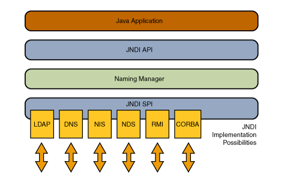

JNDI

## 概念

### 命名（naming）
计算机系统的一个基础设置就是命名服务--名字与一个对象联系，可以通过这个名字得到对象。比如，当你发邮件时，需要提供一个收件人地址，当访问一个文件时，需要提供它的名字。
一个命名服务允许你通过一个名字找一个对象。

> 计算机中的例子：
> Internet Domain Name System (DNS) 匹配域名和ip：
> www.example.com ==> 192.0.2.5
> 文件系统匹配一个文件和一个程序里文件的引用，用来直接访问文件
> c:\bin\autoexec.bat ==> File Reference
>这两个例子从广义的范围上说明了命名服务

#### 名字组成
为了在一个命名系统中寻找对象，它规定的命名规范（systems naming convention）必须要遵守。
| 命名系统 | 分隔符 | 名字 |
| --- | --- | --- |
| UNIX file system | "/" | /usr/hello |
| DNS | "." | sales.wiz.com |
| LDAP | ","and"=" | cn=Rosanna Lee , o=Sun,c=US |

### 目录
一个目录系统既联系了名字与对象，也连接了对象和属性。
不仅可以通过名字找到对象，还可以获得对象的属性或者基于属性搜寻对象。

## JNDI概览
 Java Naming and Directory Interface™ (JNDI) 是一个提供命名和目录服务的程序接口
### 架构
JNDI架构包含一组api和一组服务提供接口 service provider interface (SPI)。Java应用使用JNDIapi访问多个命名和目录服务。
SPI实现了可插拔式的命名、目录服务，允许Java通过JNDIapi访问这些服务。

### 包
JDK包含下面这些服务提供者：
  - LDAP
  - Common Object Request Broker Architecture (CORBA) Common Object Services (COS) name service
  - Java Remote Method Invocation (RMI) Registry
  - Domain Name Service (DNS)

JNDI分成5个包
  - javax.naming
  - javax.naming.directory
  - javax.naming.ldap
  - javax.naming.event
  - javax.naming.spi

#### Naming包
1. Context   核心接口，提供寻找对象，绑定，重命名，创建和销毁功能。
  - lookup   提供名字返回对象
  - bindings 绑定名字和对象
  - name     重命名
2. InitialContext 为服务提供启动点

#### Directory 和LDAP包
**Directory**

javax.naming.directory  继承了javax.naming，提供了命名和目录服务。这个包允许应用使用指定的属性检索保存在目录中的对象。
DirContext 代表一个目录context，定义了检查和更细属性的方法，通过操作一个目录实体。
  - Attributes 可以检索一个directory entity的属性，可以增删改查。

**LDAP**

javax.naming.ldap 为LDAP v3特性的应用提供了支持。事实上，绝大多数应用使用LDAP去找javax.naming.directory包就足够了，完全不需要ldap包.

#### Event和Service Provider 包
**event**

javax.naming.event 包支持命名和目录服务中的事件通知
  - Events 一个NamingEvent 代表一个命名或目录服务产生的事件，
  - Listeners NamingListener 倾听者 有不同的实现

**ServiceProvider**

javax.naming.spi 包用来为不同的服务提供者提供挂钩，以便使用JNDI可以访问相应的服务。
1. Plug-In Architecture
2. Java Object Support
3. Multiple Naming Systems
