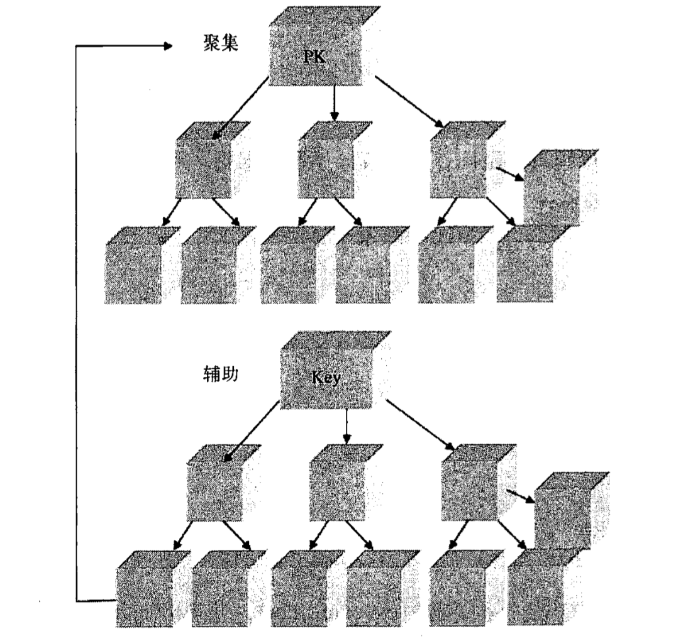

## 索引

### 为什么需要索引 (why)

数据在磁盘上是以块（也称页）的形式存储的，访问数据的时候会一并访问整个数据块。磁盘上的这些数据块与链表类似，即它们都包含一个数据段和一个指针，指针指向下一个节点（数据块）的内存地址，而且它们都不需要连续存储（即逻辑上相邻的数据块在物理上可以相隔很远）。
鉴于很多记录只能做到按一个字段排序，所以要查询某个未经排序的字段，就需要使用线性查找，即要访问N/2个数据块，其中N指的是一个表所涵盖的所有数据块。如果该字段是非键字段（也就是说，不包含唯一值），那么就要搜索整个表空间，即要访问全部N个数据块。
然而，对于经过排序的字段，可以使用二分查找，因此只要访问log2 N个数据块。同样，对于已经排过序的非键字段，只要找到更大的值，也就不用再搜索表中的其他数据块了。这样一来，性能就会有实质性的提升。

### 什么是索引 (what)

索引是对记录按照多个字段进行排序的一种方式。对表中的某个字段建立索引会创建另一种数据结构，其中保存着字段的值，每个值又指向与它相关的记录。这种索引的数据结构是经过排序的，所以可以使用二分查找，b+树搜索。
索引的缺点是占用额外的磁盘空间。因为索引保存在MyISAM数据库中，所以如果为同一个表中的很多字段都建立索引，那这个文件可能会很快膨胀到文件系统规定的上限。
> MyISAM为mysql默认的数据库引擎，自从8.0开始，mysql默认的引擎已经改为InnoDB.

  #### 聚集索引
  InnoDB中表数据按照主键顺序存放，聚集索引就是按照每张表的主键构造一颗b+树，叶节点中存有整张表的行记录数据，因此聚集索引的页节点也是数据页。每个数据页都通过一个双向的链表进行链接。
  实际的数据页只能按照一棵b+树排序，因此每个表只能有一个聚集索引。
  > 聚集索引并不是按照顺序物理的存储数据，那样维护的成本非常高。
  > 它是逻辑上连续的。通过页的双向链表链接，页按照主键排序。注意页内的记录也是通过双向链表维护，物理存储上可以同样不按照主键存储。
  #### 非聚集索引
   即叶级别不包含行的全部数据。
  叶节点：
  - 键值  索引字段的值
  - 书签  用来告诉InnoDB，哪里可以找到与索引对应的行数据

### 索引的原理 （how）
InnoDB索引是使用b+树来组织的，以每个页（16K）为基本单元,每个页包含有前后页的指针。b+树高扇出，只需要2-3次io即可从数百万的数据中找到指定行所在的页。然后再页内使用二分查找，来锁定具体行。

  #### 聚集索引
  **优点**
  - 主键的排序查找和范围查找非常快
  - 可以在索引的页节点上直接找到数据
  #### 非聚集索引
  通过它来查找数据时，会查找它的b+树，然后通过叶级别的指针获得指向主键索引的主键，然后在通过主键索引（聚集索引）来找到一个完整的行记录。他们的关系如下图所示

  

### 索引使用原则 (when)

#### 数据库层原则
+ 高选择性
  >某个字段取值很广，几乎没有重复

+ 取出表中少部分数据
  > 即使某个字段为高选择性，也可能取出很多数据
  > i.e：某个字段表示日期，查询大于某个很小的日期，就可以取出表中大部分数据。

#### 命令层原则
+ 为经常被用作查询条件，或要求排序的字段建立索引
  - order by ,group by,distinct 后面的字段
+ 经常用作表连接和查询选择字段建立索引
  - where , join
+ 对于一个存在大量更新的表，索引数目一般不超过3个。
  > 索引提高了数据访问速度，但也增加了插入，删除，更新的时间。
