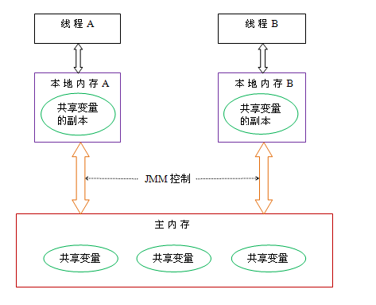
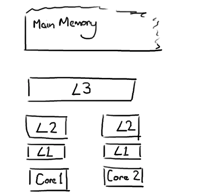
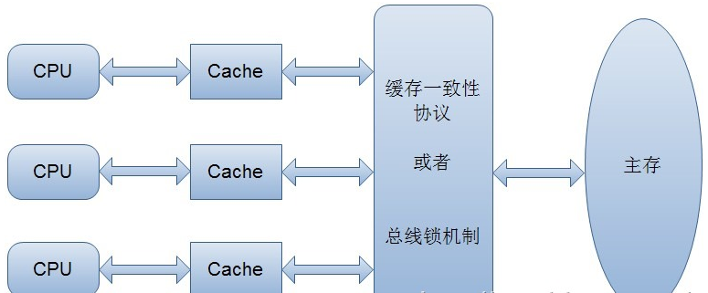

* [并发](#并发)
  * [并发包](#并发包)
    * [future](#future)
    * [线程池](#threadpoolexecutor)
  * [修饰符](#修饰符)
    * [volatile](#volatile)
      * [术语定义](#术语定义)
      * [内存可见性](#内存可见性)
      * [指令重排](#指令重排)
      * [对比synchronzied](#volatile对比synchronzied)
  * [操作系统相关概念](#操作系统相关概念)
    * [缓存](#缓存)
      * [操作系统内存可见性](#操作系统内存可见性)

#并发

## 并发包

### Future

并发编程时，一般是通过实现Runable，然后交给线程池去执行。这种情况下不需要返回值。
但是如果是一个多线程协作的程序，当前线程把一个耗时的任务交给另一个线程，并在未来某个时刻需要这个线程的结果（线程属于异步计算模型，无法直接从线程拿到结果），就需要用到Callable接口和Future了。

Future可以监视目标线程调用call()方法的情况，当调用Future的get()方法想获得结果时，当前线程就会开始阻塞，直至call()方法返回结果。

### ThreadPoolExecutor
一个ExecutorService(接口)实现，使用几个线程执行每个提交的task，通常可以使用Executors的工厂方法来配置。

**线程池解决了2个问题**
  + 当执行大量的异步任务时，它提供更高的性能，因为它减少了每个任务执行前创建线程的消耗。
  + 提供了一种手段，准备和管理执行一个集合的任务所需要的资源，包括线程，消耗。同时也统计了一些数据，例如完成任务的个数等。

**为了便于使用，提供了Executors工厂**
  + newCachedThreadPool 线程数无限，自动扩容。
  + newFixedThreadPool 固定线程数量。
  + newSingleThreadExecutor 单个线程。

**提供了参数调整**
  + corePoolSize：        线程池维护线程的最少数量
  + maximumPoolSize：     线程池维护线程的最大数量
  + keepAliveTime：       线程池维护线程所允许的空闲时间
  + unit：                线程池维护线程所允许的空闲时间的单位
  + workQueue：           线程池所使用的缓冲队列
    - 运行线程数< core    首选增加一个线程而不是放到队列
    - 运行线程数>=core   首选把新任务放到队里，而不是创建一个线程
    - 如果无法放到队列，新建一个线程处理任务，除非已经超过了最大线程数。此时任务被拒绝。
  + handler：             线程池对拒绝任务的处理策略

**有三种Queue的选择**
  + SynchronousQueue ： 直接提交，而不是放到queue。通常需要无限的maximumPoolSize,CachedThreadPool使用。
    + 无界队列，但是由于本身的特性，`某次添加元素后必须等待其他线程取走后才能继续添加`。
    + 可以避免在处理具有内部依赖性的请求时出现锁。因为b依赖于a,先后提交a,b,可以保证a必定先被执行。

  + LinkedBlockingQueue ： 无限队列,当所有线程繁忙时，会把任务放到queue中等待。FixedThreadPool和SingleThreadExecutor 使用。
    > corePoolSize熟练的线程一直在跑，永远也不会触发新的线程 （因为队列无界）

  + ArrayBlockingQueue : 固定数量队列。当maximumPoolSize数量固定时，防止资源枯竭。

## 修饰符

### volatile

 功能
  1. 保证内存可见性
  2. 防止指令重排 (JDK1.5以后)

#### 术语定义
| 术语 | 英文单词 | 描述 |
| --- | ------  | --- |
| 共享变量 |    |   在多个线程之间能够被共享的变量被称为共享变量。java中共享变量包括所有的实例变量，静态变量和数组元素。他们都被存放在堆内存中，Volatile只作用于共享变量。|
| 内存屏障| Memory Barriers | 是一组处理器指令，用于实现对内存操作的顺序限制。 |
| 缓冲行 | Cache line  | 缓存中可以分配的最小储存单位。处理器填写缓存行时会加载整个缓存行，需要使用多个朱内存读周期 |
| 原子操作 | Atomic operations | 不可中断的一个或一系列操作。 |
| 缓存行填充 | cache line fill | 当处理器识别到从内存中读取操作数是可缓存的，处理器读取整个缓存行到适当的缓存（L1，L2，L3的或所有） |
| 缓存命中 | cache hit | 如果进行高速缓存行填充操作的内存位置仍然是下次处理器访问的地址时，处理器从缓存中读取操作数，而不是从内存。 |
| 写命中 | write hit | 当处理器将操作数写回到一个内存缓存的区域时，它首先会检查这个缓存的内存地址是否在缓存行中，如果存在一个有效的缓存行，则处理器将这个操作数写回到缓存，而不是写回到内存，这个操作被称为写命中。 |
| 写缺失 | write misses the cache | 一个有效的缓存行被写入到不存在的内存区域。 |

#### jvm并发基本概念
  + 原子性
    >即一个操作或者多个操作 要么全部执行并且执行的过程不会被任何因素打断，要么就都不执行。
        i = 0;          //一个操作，对基本数据类型的变量和赋值操作都是原子性操作
        j = i ;         //两个操作，读取i，将i值赋值给j
        i++;            //三个操作，读取i值、i + 1 、将+1结果赋值给i
        i = j + 1;      //三个，同上
    >单线程环境下可以认为整个步骤都是原子的。多线程中Java只保证了基本数据类型的变量和赋值才是原子的。
    > 在32位的JDK环境下，对64位数据的读取不是原子性操作，如long、double.
    > volatile是无法保证复合操作的原子性

  + 可见性
    > 多个线程访问同一个变量时，一个线程修改了这个变量的值，其他线程能够立即看得到修改的值。
    >
    > 当一个变量被volatile修饰后，表示着线程本地内存无效，当一个线程修改共享变量后他会立即被更新到主内存中，当其他线程读取共享变量时，它会直接从主内存中读取。
    当然，synchronize和锁都可以保证可见性。
  + 有序性
    >即程序执行的顺序按照代码的先后顺序执行,不过不影响指令重排。

#### 内存可见性

  概念：JVM 内存模型

  

  Java内存模型规定，`共享变量`储存在主内存中，每个线程都有自己的工作内存（比如CPU寄存器），线程只能访问自己的工作内存，不能访问其他线程的工作内存。

  每个线程的工作内存中都保存了主内存中共享变量的副本，线程要要操作共享变量，只能通过操作自己工作内存中的共享变量副本来实现，操作结束后在同步会主内存。

  为了保证多线程操作主内存数据完整性，Java内存模型规定工作内存与主内存之间交互的协议，定义了8种原子操作：
    1. lock:将主内存中的变量锁定，为一个线程所独占

    2. unclock:将lock加的锁定解除，此时其它的线程可以有机会访问此变量

    3. read:将主内存中的变量值读到工作内存当中

    4. load:将read读取的值保存到工作内存中的变量副本中

    5. use:将值传递给线程的代码执行引擎

    6. assign:将执行引擎处理返回的值重新赋值给变量副本

    7. store:将变量副本的值存储到主内存中

    8. write:将store存储的值写入到主内存的共享变量当中

  >可见性的一个例子
  >
  > 上面线程A和B都访问一个数据，假设是一个布尔变量，初始值为true。当线程A获得锁（lock）之后在自己的工作内存操作共享变量,操作完之后将自己工作内存中的false副本写入主内存。此时主内存是false.
  >
  > B一直在做一个循环根据共享变量，那么在B从共享内存将false同步回自己的工作内存之前，A对于布尔变量的改变，B是不可见的（即A操作之前的值）。
  > 注意,最终是一定会同步会主内存中，但是时间不是立刻。
  >
  >此时，将布尔变量标志为 volatile，就能保证B立刻终止。
  >或者使用synchronize同步布尔变量的get/set方法，要get必须要set释放。

  `volatile保证可见性的原理`

 在每次访问变量时都会进行一次刷新，因此每次访问都是主内存中最新的版本。所以volatile保证变量修改的实时可见性。

#### 指令重排

**概念**
指令重排序是JVM为了优化指令，提高程序运算效率，在不影响单线程程序执行结果的前提下，尽可能的提高并行度。编译器处理器也是遵循这一个目标，但是多线程情况下就会给带来困扰。

as-if-serial语义是指：不管如何重排序（编译器与处理器为了提高并行度），（单线程）程序的结果不能被改变。这是编译器、Runtime、处理器必须遵守的语义。

分类： 编译器重排序、运行时重排序。

>不同指令间可能存在数据依赖，比如下面的计算圆面积的代码

    double r = 2.3d;         //(1)
    double pi =3.1415926;    //(2)
    double area = pi* r * r; //(3)
>area的计算依赖于1和2的计算结果，但是1与2的计算没有依赖。执行顺序是123，还是213，对于最后结果没有影响。
>编译器、Runtime可以在优化时根据情况重排。

**重排导致的问题**

如果一个操作不是原子的，就会给JVM留下重排的机会。

`A线程指令重排导致B线程出错`
  + 在A线程中：
        context = loadContext();
        inited = true;
  + 在B线程中：
        while(!inited ){     //根据线程A中对inited变量的修改决定是否使用context变量
          sleep(100);
        }
        doSomethingwithconfig(context);

  + 假设线程A中发生了指令重排序:
        inited = true;
        context = loadContext();
  那么B中很可能就会拿到一个尚未初始化或尚未初始化完成的context,从而引发程序错误。

`指令重排导致单例模式失效`

一个经典的懒加载的单例模式：

      public class Singleton {

        private static Singleton instance = null;

        private Singleton() { }

        public static Singleton getInstance() {
          if(instance == null) {
            synchronzied(Singleton.class) {
              if(instance == null) {
                  instance = new Singleton();
              }
            }
          }
          return instance;
        }
      }

看似是一条的语句：instance = new Singleton(),从操作上看并不是原子的，可以抽象为以下几条JVM命令：

    memory =allocate();    //1：分配对象的内存空间
    ctorInstance(memory);  //2：初始化对象
    instance =memory;      //3：设置instance指向刚分配的内存地址

上面操作2依赖于1，但是3并不依赖2.所以JVM可以对它们指令重排。重新排序后如下：

    memory =allocate();    //1：分配对象的内存空间
    instance =memory;      //3：instance指向刚分配的内存地址，此时对象还未初始化
    ctorInstance(memory);  //2:初始化对象

可以看到指令重排之后，instance指向分配好的内存放在了前面，而这段内存初始化成对象放在了后面。

在线程A执行这段赋值语句，在初始化分配对象之前就已经将其赋值给instance引用，恰好另一个线程进入方法判断instance引用不为null，然后就将其返回使用，导致出错。

**volatile如何解决指令重排**

解决方案：例子1中的inited和例子2中的instance以关键字volatile修饰之后，就会阻止JVM对其相关代码进行指令重排，这样就能够按照既定的顺序指执行。

volatile关键字通过提供“内存屏障”的方式来防止指令被重排序，为了实现volatile的内存语义，编译器在生成字节码时，会在指令序列中插入内存屏障来禁止特定类型的处理器重排序。大多数的处理器都支持内存屏障的指令。

对于编译器来说，发现一个最优调整来最小化插入屏障的总数几乎不可能，为此，Java内存模型采取保守策略。下面是基于保守策略的JMM内存屏障插入策略：

    在每个volatile写操作的前面插入一个StoreStore屏障。

    在每个volatile写操作的后面插入一个StoreLoad屏障。

    在每个volatile读操作的后面插入一个LoadLoad屏障。

    在每个volatile读操作的后面插入一个LoadStore屏障。

#### volatile对比synchronzied

**volatile优劣点**

`优点`：相比于synchronzied 代码块的代码锁，volatile是一种稍弱的同步机制，在访问volatile变量时不会执行加锁操作，也就不会执行线程阻塞，因此volatile更轻量。
>在两个或者更多的线程需要访问的成员变量上使用volatile。当要访问的变量已在synchronized代码块中，或者为常量时，没必要使用volatile。

`缺点`：由于使用volatile屏蔽掉了JVM中必要的代码优化，所以在效率上比较低，因此一定在必要时才使用此关键字。

**区别**

`volatile`:
  + 不加锁，只保证可见性。
  + volatile声明的变量如果当前值需要用到该值以前的值，那么volatile不起作用。即，count++,count = count + 1 ，都是非原子操作。

`synchronized`:
  + 加锁（同步）机制，既保证可见性又保证原子性

>在需要同步的时候，第一选择应该是synchronized关键字，这是最安全的方式，尝试其他任何方式都是有风险的.在jdK1.5之后，对synchronized同步机制做了很多优化，如：自适应的自旋锁、锁粗化、锁消除、轻量级锁等，使得它的性能有了很大的提升。
>
>当且仅当满足以下所有条件时，才应该使用volatile变量：
  1. 对变量的写入操作不依赖变量的当前值，或者你能确保只有单个线程更新变量的值。
  2. 该变量没有包含在具有其他变量的不变式中。

## 操作系统相关概念

### 缓存

CPU直接访问主内存是非常慢的，cpu和内存，io之间相差几个数量级的速度，所以不得不在cpu与主内存之间加入一层读写速度接近cpu运算速度的高速缓存来（cache）来作为内存与cpu的缓冲。
>如果你正对一块数据做多次的运算，执行运算的时候把它加载到离cpu更近的地方就很有必要了。

越靠近cpu，缓存越快，越小。L1（一级缓存）很小但非常快。L2更大些也更慢些，并且依旧只能被一个单独的CPU核使用。
L3更多的在多核处理器上，更大更慢，但它是被`单个插槽上所有CPU共享`。最后所有的CPU共享主存。
>当CPU执行运算的时候，它先去L1查找所需的数据，再去L2，然后是L3，最后如果这些缓存中都没有，所需的数据就要去主内存拿。走得越远，运算耗费的时间就越长。

Martin和Mike的 QCon presentation演讲中给出了一些缓存未命中的消耗数据：

| 从CPU到	| 大约需要的 CPU 周期	| 大约需要的时间 |
| ---- | --------------------| ------------ |
| 主存	| 	| 约60-80纳秒 |
| QPI总线传输(between sockets, not drawn) | 	|	约20ns |
| L3 cache | 约40-45 cycles | 	约15ns |
| L2 cache	| 约10 cycles |	约3ns |
| L1 cache	| 约3-4 cycles |	约1ns |
| 寄存器	| 1 cycle |   |

#### 操作系统内存可见性

CPU高速缓存虽然解决了效率问题，但是它会带来一个新的问题：缓存一致性（cache coherence）。在程序运行中，会将运行所需要的数据复制一份到CPU高速缓存中，在进行运算时CPU不再也主存打交道，而是直接从高速缓存中读写数据，只有当运行结束后才会将数据刷新到主存中。

一个简单的例子：

    i++i++

当线程运行这段代码时，首先会从主存中读取i( i = 1)，然后复制一份到CPU高速缓存中，然后CPU执行 + 1 （2）的操作，然后将数据（2）写入到告诉缓存中，最后刷新到主存中。
有问题的是在多线程中。如下：
假如有两个线程A、B都执行这个操作（i++），按照我们正常的逻辑思维主存中的i值应该=3，但是显然不对。

两个线程从主存中读取i的值（1）到各自的高速缓存中，然后线程A执行+1操作并将结果写入高速缓存中，最后写入主存中，此时主存i==2,线程B做同样的操作，主存中的i仍然=2。所以最终结果为2并不是3。这种现象就是缓存一致性问题。

`解决缓存一致性方案有两种`

  - 通过在总线加LOCK#锁的方式
    >采用一种独占的方式来实现的，即总线加LOCK#锁的话，只能有一个CPU能够运行，其他CPU都得阻塞，效率较为低下。

  - 通过缓存一致性协议
    >缓存一致性协议（MESI协议）它确保每个缓存中使用的共享变量的副本是一致的。其核心思想如下：当某个CPU在写数据时，如果发现操作的变量是共享变量，则会通知其他CPU告知该变量的缓存行是无效的，因此其他CPU在读取该变量时，发现其无效会重新从主存中加载数据。

这里只是操作系统层面的可见性，关于jvm内存可见性，请见[jvm内存可见性](#内存可见性)

### 指令重排
